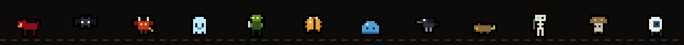
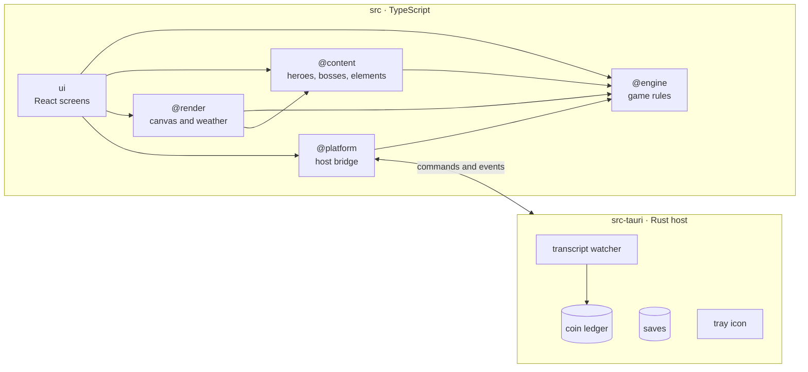

<div align="center">



### The coins are the tokens your coding agents burn.

An endless idle RPG that lives in your system tray. Your agents write code, the party fights,
and every token they spend becomes a coin you can put into your heroes.

[](#roadmap)
[](https://github.com/ostapondo/token-heroes/actions/workflows/ci.yml)
[](CONTRIBUTING.md)
[](LICENSE)
<br>
[](https://tauri.app)
[](src-tauri)
[](src)
[](src/ui)

[How it works](#how-it-works) · [The fight](#the-fight) · [Run it](#run-it) · [**Contribute**](#come-build-it-with-us) · [Architecture](#architecture)

</div>

<br>

## How it works



Token Heroes sits next to your clock as a pixel sword. On macOS your coin balance shows beside it.
Click the sword and a small window opens on an arena where your party fights forever. You never grind. Instead, the Rust host watches the session logs
your coding agents already write on your disk, counts the tokens they burn and credits one coin
per token. You spend those coins on levels and hires.

The fight never pays you. When the party is stuck on a boss, the answer is to ship more work.

| Agent       | Where it reads                                                  | What counts as burned                                      |
| ----------- | --------------------------------------------------------------- | ---------------------------------------------------------- |
| Claude Code | `~/.claude/projects/**/*.jsonl` (`CLAUDE_CONFIG_DIR`)           | input + output + cache writes, not cache reads             |
| Codex       | `~/.codex/sessions/**/*.jsonl` (`CODEX_HOME`)                   | input − cached input + output                              |
| Gemini CLI  | `~/.gemini/tmp/**/*.jsonl` (`GEMINI_CLI_HOME`)                  | total − cached input                                       |
| Qwen Code   | `~/.qwen/projects/**/*.jsonl` (`QWEN_RUNTIME_DIR`, `QWEN_HOME`) | total − cached input                                       |
| OpenCode    | `~/.local/share/opencode/opencode.db` (`OPENCODE_DB`)           | input + output + reasoning + cache writes, not cache reads |
| Kilo Code   | `~/.local/share/kilo/kilo.db` (`KILO_DB`)                       | the same as OpenCode, whose fork it is                     |

Tools that drive these agents, such as T3 Code, are counted through the agent's own logs.
Cursor, Windsurf, Warp and Aider keep no per-request token counts on disk, so they cannot be
counted yet.

> [!TIP]
> On the first launch the host reads the transcripts already on your disk, so your existing history
> becomes your starting purse.

## The fight

- **Endless stages.** Packs of 3 enemies grow by one every 10 stages, up to 6. Every 5th stage is
  a boss with a 30-second timer.
- **Auto battle.** Heroes attack on their own. Crits land 10% of the time for 2.5× damage.
- **Tap to strike.** Click the arena to hit the front foe for half your party's power.
- **Ultimate.** About an hour of agent work (a million burned tokens) charges one ultimate worth
  roughly ten seconds of your party's damage.
- **Milestones.** Every 25 levels a hero's damage and health grow fourfold.
- **Wipes are gentle.** If the party falls, it is back in 10 seconds. Levels and coins stay.
- **Offline progress.** Close the window and the party keeps fighting for up to 8 hours.
- **Ascension.** From stage 100 the party may ascend: every hero goes back to level 1 and the
  party to stage 1, but with lasting power, the deepest stage over 50, squared (stage 130 →
  ×6.8). Levels are not refunded; the power wins them back with about a quarter of the tokens
  they took. The next ascension opens a quarter deeper. You confirm first and see the change.

All of these numbers live in one file, [`src/engine/balance.ts`](src/engine/balance.ts).

### Ten heroes



You start with the Wanderer. Strikers deal damage, tanks hold the party's health and healers
restore a share of it. Every later hero is stronger per coin than the one before; the rare ones
appear only once your lifetime burn passes their threshold. Anyone who reaches the Paladin has
burned 800 million tokens.

### Thirty bosses



Every boss is one of 8 creatures drawn in one of 9 elements. The creature brings the attack:
dragons breathe fire, golems and slimes slam, wraiths swing a scythe, spiders spit, and demons and
knights lunge. The element brings the palette and the weather: lava floors and embers for fire,
frosted edges and snow for ice, lightning and rain for storms, a summoning ring for blood.



## Your tokens stay yours

- The host reads only the `usage` numbers in each transcript line. Your prompts and code are never
  stored or shown.
- Nothing leaves your machine. The app has no network client, and its content security policy
  allows only the local Tauri bridge.
- Everything the game keeps sits in `~/.token-heroes/`: `ledger.json` (coins burned and spent,
  saved together with how far each transcript has been read, so a crash never credits a token
  twice), `save.json` (the party and the stage), `settings.json` and `logs/`. The game saves after every purchase and whenever the window hides.
- Only the host can add coins. The window can spend them, and the host refuses any spend above
  your balance.

It is light, too. New tokens reach your wallet within a second. On Apple Silicon the release
build is a 3.6 MB app (a 1.75 MB `.dmg`), and it idles in the tray at about 58 MB of memory and
0% CPU.

## Run it

There are no prebuilt releases yet, so you build from source. Once releases ship, the game
offers each new version in its footer and installs it in one click. **Report a bug** in the
footer or the tray menu opens an issue with your version filled in. You need:

- [Node.js](https://nodejs.org) 22 or newer and [pnpm](https://pnpm.io) 10
  (`corepack enable` picks the pinned version)
- [Rust](https://rustup.rs) 1.85 or newer
- The [Tauri prerequisites](https://tauri.app/start/prerequisites/) for your OS

```bash
pnpm install
pnpm tauri dev     # the real tray app, reading your agents' transcripts
```

Want to work on the screens without the tray? `pnpm dev` opens the UI in a browser with a fake
host. It starts you on 17.9M burned tokens and burns a few thousand more every 2.5 seconds.

| Command            | What it does                               |
| ------------------ | ------------------------------------------ |
| `pnpm dev`         | UI in a browser with a fake host           |
| `pnpm tauri dev`   | the real tray app                          |
| `pnpm tauri build` | an installer for your OS                   |
| `pnpm check`       | format, lint, types, tests and unused code |
| `pnpm lint:rust`   | clippy with warnings as errors             |

## Come build it with us



Token Heroes is young, and it is open to contributors. You can make a real difference in an
evening, and **you don't need to know Rust or React to start**. The game's content is plain data,
one entity per file, and the registry finds new files on its own.

| If you like…       | You could                                                                    |
| ------------------ | ---------------------------------------------------------------------------- |
| Pixel art          | name one of the 42 free creature × element bosses, or draw a new enemy       |
| Game design        | tune `balance.ts`, design a hero's role, propose a new mechanic              |
| Canvas and effects | add a weather kind, a particle preset or a combat effect in `src/render`     |
| Rust               | teach the host a new agent, such as Copilot CLI, Goose, Cline or Amp         |
| UI                 | polish the HUD and the hero roster in `src/ui`                               |
| Testing            | run it on Windows or Linux and tell us what broke                            |
| Languages          | the English catalogue in `src/i18n` is typed and ready for a second language |

Read **[CONTRIBUTING.md](CONTRIBUTING.md)**. It has the setup, the house rules and step-by-step
recipes for a boss, an enemy, a hero, an element and a token source. Coding agents are welcome
too: [AGENTS.md](AGENTS.md) holds the rules they need, and every token they burn on this repo
levels your party.

## Architecture



Arrows point at what a layer may import. Each layer is reached only through its alias, and the
linter fails on any crossing. Game rules stay in TypeScript and never move into Rust. The engine
is deterministic: all randomness comes from a seeded generator in its state, so a battle can be
replayed and offline progress can be fast-forwarded.

```text
src/
  engine/     stages, battle, levels, offline progress, balance.ts
  content/    one file per element, creature, boss, enemy and hero
  render/     canvas scene, sprite cache, weather, combat effects
  platform/   the host contract, with Tauri and browser hosts
  i18n/       the typed English catalogue
  ui/         React screens and the HUD (zustand, Panda CSS)
src-tauri/    tray, transcript watcher, coin ledger, saves
docs/         concept boards and the art in this README
```

## Roadmap

The game runs end to end today: the watcher, the ledger, the battle, the heroes and the saves.
Next up:

- [ ] Prebuilt installers for macOS, Windows and Linux
- [ ] More agents as token sources: Copilot CLI, Goose, Cline, Roo Code, Amp
- [ ] The remaining 42 creature × element bosses
- [ ] A second language

Have an idea? [Open an issue](../../issues/new/choose). We read every one.

<br>

<div align="center">


[MIT](LICENSE) · The art in this README is drawn from the game's own sprite files.

</div>
